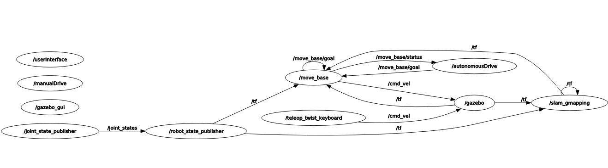

# Assignment 3: ROS Mobile Robots Simulator

Developer: Thomas Campagnolo (5343274)

Robotics Engineering, University of Genova.

This is the third and final assignment of the Research Track I course. The simulation involves a mobile robot positioned inside an environment, and it's equipped with a laser scanner in order to detect the presence of obstacles, such as the walls of the environment. 
The aim of the project is to develop an architecture to control the robot in the environment. The software will rely on the `move_base` and `gmapping` packages for localizing the robot and plan the motion. The implemented architecture allows the user to perform three different robot behavior modes, in particular:
* Reach autonomously the coordinate (x, y) entered by the user, thus obtaining an autonomous guide of the robot; 
* Let the user to drive the robot with the keyboard, thus having the opportunity to try a manual robot driving experience; 
* Let the user to guide the robot with the keyboard with assistance to avoid collisions with obstacles.

The project is developed in ROS and Python.

## Installing and clone

The simulator requires the version of [ROS Noetic](http://wiki.ros.org/noetic/Installation) and the following packages if they are not already installed:

* teleop twist keyboard package:
```
$ sudo apt-get install ros-noetic-teleop-twist-keyboard
```
* ros navigation stack:
```
$ sudo apt-get install ros-noetic-navigation
```
* xterm package:
```
$ sudo apt-get install xterm
```

Furthermore, is necessary to clone the following GitHub repositories into the src directory of your ROS workspace:
```
$ git clone https://github.com/CarmineD8/slam_gmapping.git
```
remember to switch on the branch `noetic` using: `git checkout noetic`, and
```
$ git clone https://github.com/thomascampagnolo97/final_assignment.git
```

After you have cloned this packages, you need to build your workspace with `catkin_make` and update it with `rospack profile` (remember to go to the root directory of the workspace before running the commands).

## Running

When you have download and build the workspace, make sure that all the `.py ` files in the scripts folder are executables, otherwise you can make it with: 
```
chmod +x <name_file_python.py>
```
Now you can run the simulation, using the following commands in three separate terminals.
* Run the robotic simulation on Gazebo and Rviz:
```
$ roslaunch final_assignment simulation_gmapping.launch
```
* Launch the move_base for the path planning in space:
```
$ roslaunch final_assignment move_base.launch
```
* Run the user interface node, giving the possibility to the user to choose the robot driving mode:
```
$ roslaunch final_assignment launcher.launch
```
The simulation in the Gazebo and Rviz environment looks like this:


## Structure Description

The objective is to allowing the user to choose between the driving modality specified in the introduction of the project such that the robot go around the environment.
In addition, the user interface allows to reset the position of the robot to the initial state or to exit the program by closing all active nodes.

The pseudocode of the `user_interface_controller.py` code that allows to manage each user's choice is the following:
```
while userInterface node is running
while rospy not on shutdown
 print interface
 get user input
 
 if user input is 1:
 autonomous_drive()

 elif user input is 2:
 manual_drive()

 elif user input is 9:
 reset_world()

 elif user input is 0:
 rospy is shutdown

 else:
 user input not valid
```


### Autonomous Drive

This function allow the robot to move autonomously to reach the desired target. The user must enter the `x` and `y `coordinates, the `autonomousDrive` node checks if the set goal is reached by calling the `GoalCoordinates` service and sends the coordinates to the `menage_auto_drive(request)` function in `autonomous_drive.py`, which allows to manage the autonomous mode by setting the target and waiting for the result within a set maximum time. Using the `move_base` package action, given a goal in the world, the robot will then attempt to reach it.

The structure of the software in this modality is the following:


### Manual Drive

This function manage the manual driving experience: by calling the `manual_driving` service, the user can choose the type of experience. Selecting mode 1 in `manual_drive.py` will start the full manual mode without assistance through the use of the keyboard; if the user selects mode 2, `manual_drive.py` will use a manual driving experience with assistance to avoid collisions with obstacles.

Depending on the chosen mode (1 or 2), the `menage_manual_drive(request)` function will execute the appropriate launch file:
* `request.manual_driving_mode == 1` :  the `full_manual_drive.launch` is launched, going to execute the `teleop_twist_keyboard` interface in the new xterm terminal;

* `request.manual_driving_mode == 2` :  the `assisted_manual_drive.launch` is launched, calling the `teleop_twist_keyboard` interface in the new xterm terminal and the obstacle avoidance; remapping the topic `/cmd_vel` to `/collision_cmd_vel` to allow the driving assistance.

The structure of the software in the full manual modality is the following:


The structure of the software in the assisted manual modality is the following:


## Possible improvements

Some of the possible improvements can be: 
* the implementation of a dedicated graphic interface for the management of driving modes;
* give the user the possibility to cancel the target goal while the robot is moving;
* make the robot move in the environment at the first start in order to save the complete map so as to know in advance if the goal coordinates are reachable or not.
